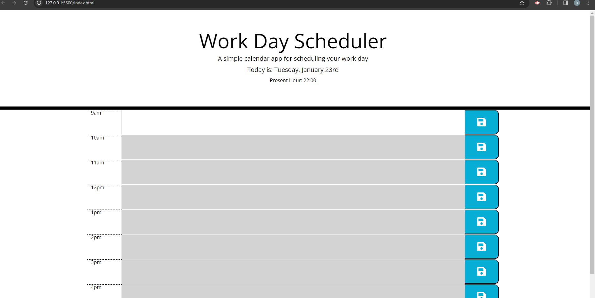

# work-day-scheduler-dominic
work day schedule to track activities throughout the working day. 
This challenge was regarding a work day calendar. The challenge fundermentally utilised Jquery through the means of day.js! 

With the use of the day.js library we were able to at stylings and functionality that ordinarily would be much more challenging. 

The day.js cdn link was added to the HTML in order to allow the library to be picked up by the .js file. 

